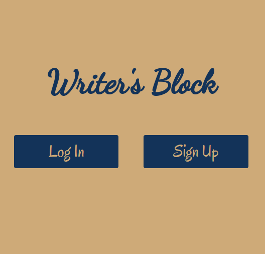
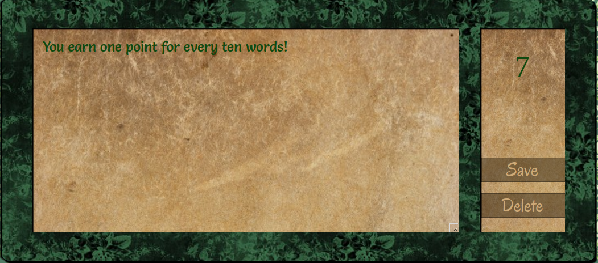
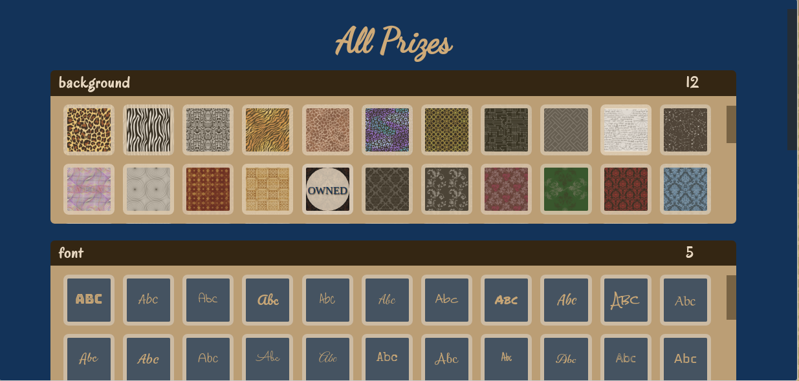
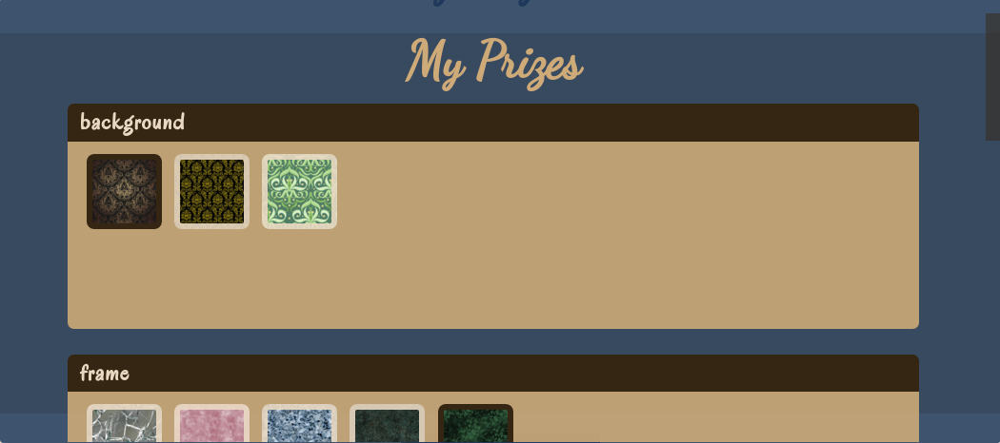

#Writer's Block

<a href="https://writersblockapp.herokuapp.com/"></img></a>

<a href="https://writersblockapp.herokuapp.com/">Writer's Block</a> is a single-page productivity app with a Ruby on Rails backend and a React.js frontend.  It rewards you for working on writing projects; you earn one point for every ten words you add to the word count.

<a href="https://writersblockapp.herokuapp.com/"></img></a>

You can use your points to buy customizations--including backgrounds, fonts, and text colors--for the interface.  

<a href="https://writersblockapp.herokuapp.com/"></img></a>

Once you have bought a customization, it will show up in your settings menu; just click on it to apply it to your project!  

<a href="https://writersblockapp.herokuapp.com/"></img></a>

Keep writing to collect and try out all the customizations; there are thousands of possible combinations!
